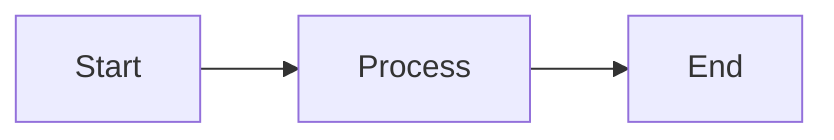
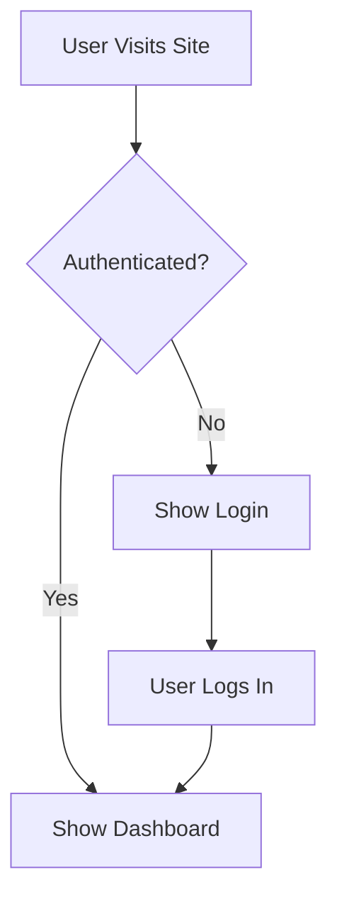
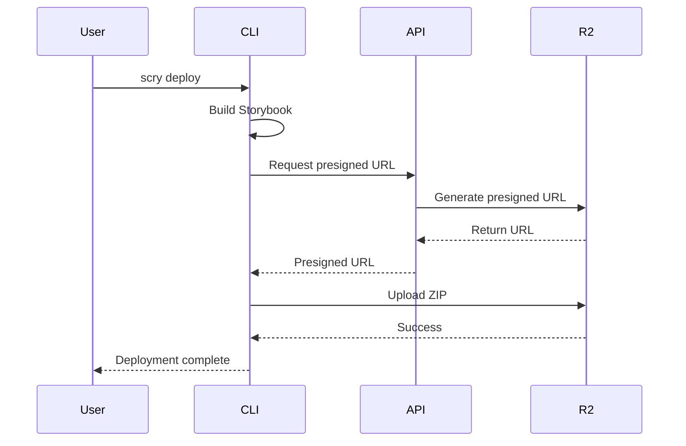
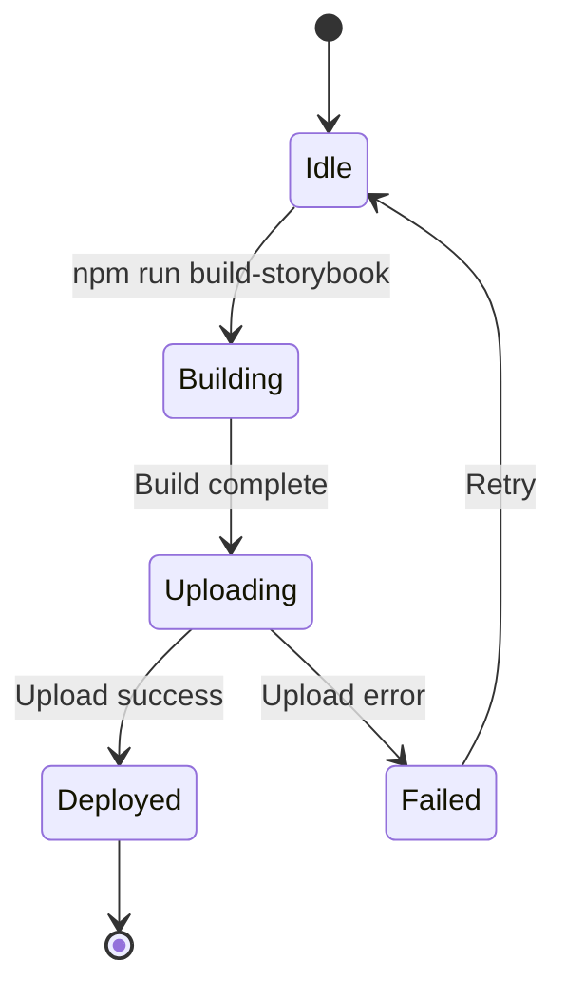
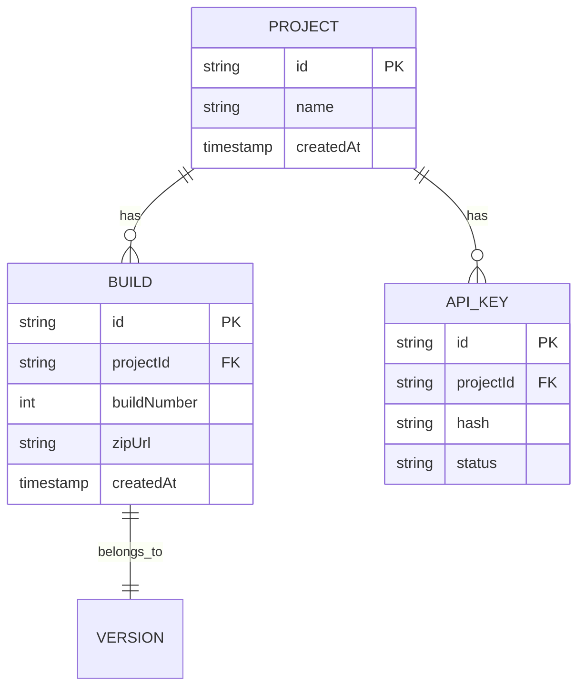
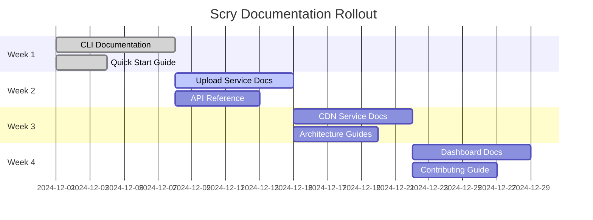
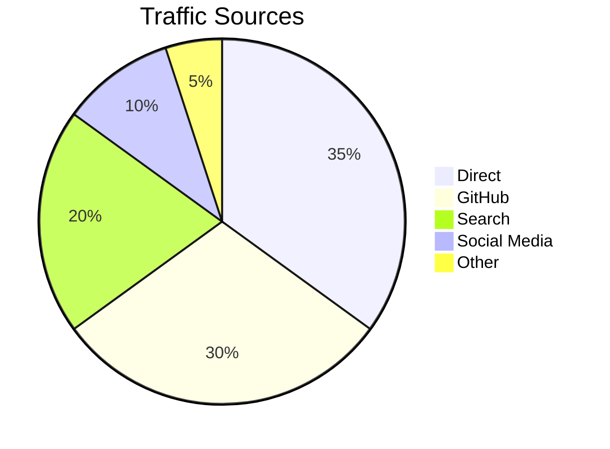

# Mermaid Diagrams Setup Guide

This guide shows you how to use Mermaid diagrams in your VitePress documentation.

## Installation

The required packages have been added to `package.json`. Install them by running:

```bash
cd docs
npm install
```

This will install:
- `vitepress-plugin-mermaid` - VitePress plugin for Mermaid support
- `mermaid` - The Mermaid diagram library

## Configuration

The configuration has already been updated in `.vitepress/config.ts`:

```typescript
import { defineConfig } from 'vitepress'
import { withMermaid } from 'vitepress-plugin-mermaid'

export default withMermaid({
  // ... your existing config
})
```

## Usage in Markdown

### Basic Syntax

Use triple backticks with `mermaid` language identifier:

````markdown

````

### Examples

#### 1. Flowchart

````markdown

````

**Renders as:**


#### 2. Sequence Diagram

````markdown

````

**Renders as:**


#### 3. State Diagram

````markdown

````

**Renders as:**


#### 4. Entity Relationship Diagram

````markdown

````

**Renders as:**


#### 5. Gantt Chart (Project Timeline)

````markdown

````

**Renders as:**


#### 6. Pie Chart

````markdown

````

**Renders as:**


## Diagram Types Reference

| Type | Identifier | Use Case |
|------|-----------|----------|
| Flowchart | `graph` or `flowchart` | Process flows, decision trees |
| Sequence | `sequenceDiagram` | API interactions, workflows |
| Class | `classDiagram` | Object-oriented design |
| State | `stateDiagram-v2` | State machines, lifecycles |
| ER | `erDiagram` | Database schemas |
| Gantt | `gantt` | Project timelines |
| Pie | `pie` | Proportions, distributions |
| Git | `gitGraph` | Git history visualization |

## Customization

You can customize Mermaid theme in `.vitepress/config.ts`:

```typescript
export default withMermaid({
  // ... other config
  
  mermaidPlugin: {
    class: 'mermaid'
  },
  
  mermaid: {
    // Mermaid configuration
    theme: 'default', // 'default', 'dark', 'forest', 'neutral'
    themeVariables: {
      primaryColor: '#007acc',
      primaryTextColor: '#fff',
      primaryBorderColor: '#005a9e',
      lineColor: '#004578',
      secondaryColor: '#41d1ff',
      tertiaryColor: '#f0f0f0'
    }
  }
})
```

## Troubleshooting

### Diagrams not rendering

1. **Make sure packages are installed:**
   ```bash
   cd docs
   npm install
   ```

2. **Check your markdown syntax:**
   - Use triple backticks (```)
   - Specify `mermaid` as the language
   - Ensure proper Mermaid syntax

3. **Clear cache and rebuild:**
   ```bash
   rm -rf docs/.vitepress/cache
   npm run dev
   ```

### TypeScript errors

The TypeScript errors in config.ts are expected until you run `npm install`. They will disappear after installation.

## Resources

- [Mermaid Documentation](https://mermaid.js.org/)
- [Mermaid Live Editor](https://mermaid.live/) - Test diagrams online
- [VitePress Mermaid Plugin](https://github.com/emersonbottero/vitepress-plugin-mermaid)

## Next Steps

1. Run `npm install` in the docs directory
2. Start the dev server: `npm run dev`
3. Add Mermaid diagrams to your markdown files
4. See them render in real-time!