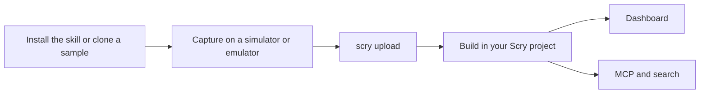

<!-- DRAFT: sample repos private until founder go -->

# Capture your app's screens

Put the screens of your iOS, Android or React Native app in your Scry project. Each screen is captured on a simulator or emulator as a PNG, uploaded as a build, and from then on listed in the dashboard's Builds tab and searchable by your AI assistant through the [MCP server](/guide/mcp), the same way a Storybook build is.

**The fastest way to start with your own app is the Scry skill.** Install it, ask your AI coding assistant to "set up Scry capture for this app", and it wires your app for capture and checks the result. See [Set up with the Scry skill](#set-up-with-the-scry-skill) below.

**No code of yours is uploaded.** Scry receives PNG screenshots and a small manifest. React Native captures also include a layout tree per screen (component names, text and positions), never source files.

## The journey

Every native path has the same five steps:

1. **Install.** Add the capture setup to your app: with the [Scry skill](/guide/skill#native-app-capture), or by cloning a sample app and following its page.
2. **Capture.** Run the capture on a simulator or emulator. It opens each screen on its own and writes a [Scry Capture Format](/guide/capture-bundle-format) bundle: one PNG per screen and a small `scf.json` manifest.
3. **Upload.** Check the bundle with `scry upload <bundle> --dry-run`, then upload it with `scry upload <bundle>`. You need a project ID and a project API key.
4. **See it.** The build appears in your project's **Builds** tab with its source, for example **SwiftUI · iOS**, **Compose · Android** or **React Native · iOS**.
5. **Use it.** Ask your AI assistant for a screen through the MCP server, and see each build, its device and its screen count in the dashboard. Linking a native screen to a Figma frame from the Scry Link plugin is not available yet.



Here `scry upload` is run as `npx @scrymore/scry-deployer upload <bundle>`, with `SCRY_PROJECT_ID` and `SCRY_API_KEY` set in the environment.

## Which path is yours

| Your app | Start here | How the screens are captured |
| --- | --- | --- |
| SwiftUI (iOS) | [iOS (SwiftUI)](/guide/ios-swiftui) | A reference script from the sample app and the Scry skill: it opens each screen on the iOS Simulator by launch argument and takes a screenshot. |
| Jetpack Compose (Android) | [Android (Compose)](/guide/android-compose) | A reference script from the sample app and the Scry skill: it opens each screen on an emulator by intent extra and takes a screenshot with `adb`. |
| React Native with Storybook | [React Native](/guide/react-native) | The built-in `scry capture rn` command, which drives your on-device Storybook. No capture script to add. |
| Another tool (UIKit, Flutter, a screenshot test suite) | [Capture bundle format](/guide/capture-bundle-format) | You write the bundle yourself with your own tool. The page documents the format. |

For SwiftUI and Compose, capture is a **reference script** that you copy from the sample app (or let the skill add to your app). It is not a built-in Scry command; the only Scry command involved is `scry upload`. [Capture sources](/guide/capture-sources) explains how Scry tells these builds apart from your Storybook builds and from each other.

## Set up with the Scry skill

The `scry-native-capture-setup` skill does the wiring that an existing app needs: a way to open one screen on its own, a registry of the screens to capture, fixed data so each screen renders the same every run, the capture scripts, and optionally a CI workflow. Install it in your app's repository:

```bash
npx skills add scryorg/scry-node --skill scry-native-capture-setup
```

Then ask your assistant:

> Set up Scry capture for this app.

The skill works with SwiftUI, Jetpack Compose and React Native apps. It asks only what it cannot find in your project. If a simulator or emulator is available where the assistant runs, it runs the capture and `upload --dry-run` and shows you the screenshots; otherwise it lists the commands for you to run on a Mac. Either way it stops before uploading. **It never uploads, and never touches your API key, without your go.** The full description is on [Set up with AI](/guide/skill#native-app-capture); it is also described at the end of each platform page.

If you would rather start from a working example, clone a sample app: `scry-sample-ios` (SwiftUI), `scry-sample-android` (Compose) or `scry-sample-rn` (React Native). Each platform page walks through its sample, step by step, with a short video for each step.

## Troubleshooting

Each platform page ends with a Troubleshooting section that quotes the messages the CLI prints:

- [iOS (SwiftUI)](/guide/ios-swiftui#troubleshooting)
- [Android (Compose)](/guide/android-compose#troubleshooting)
- [React Native](/guide/react-native)

For the Scry CLI in general, see [Troubleshooting](/guide/troubleshooting).

## Privacy and data

An upload sends the PNG screenshots and the `scf.json` manifest (for React Native, also a layout tree per screen), plus the commit SHA and branch the upload is run from. The manifest lists each screen's id and name, the device it was captured on, and the source file path and line you registered for it. No source text is uploaded: `--include-source` is off by default and none of these pages use it. Details are on each platform page.

## Feedback and support

Tell us on the [feedback form](/feedback) or email <feedback@scrymore.com>.

## Changelog

- **Draft** — first version of this page. Not yet published.
