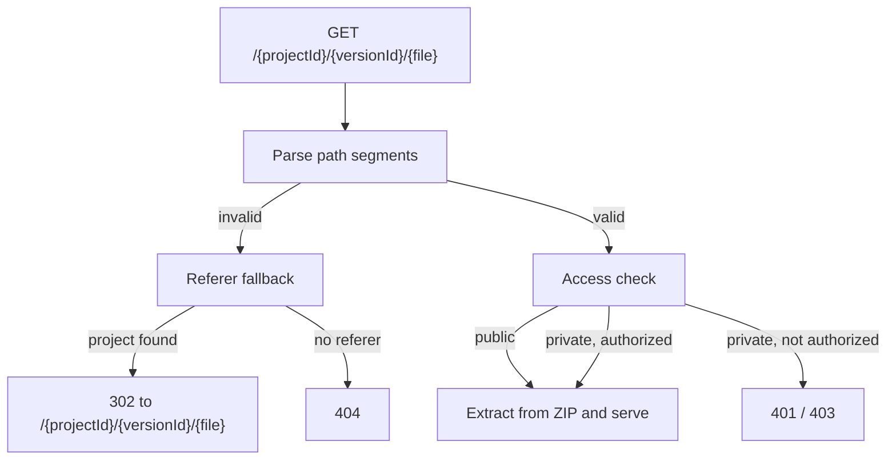

# Path Routing

The CDN serves every project from one hostname, resolving the project and version from the path:

```
https://view.scrymore.com/{projectId}/{versionId}/{file}
```

For example, the [demo Storybook](https://view.scrymore.com/U9m2H2yeC9wFiR4hlMta/demo-1786260947/) resolves project `U9m2H2yeC9wFiR4hlMta`, version `demo-1786260947`, and the default `index.html`.

::: tip Previously subdomain-based
Earlier versions routed by subdomain (`view-{project}.example.com`). That is gone: one hostname avoids a wildcard certificate per project and keeps every build behind the same access checks. The helper is still called `subdomain.ts` in the source, but its job is `parsePathForUUID` — it parses path segments.
:::

## How a request resolves



## Absolute asset paths

A story that references an asset absolutely — `src="/logo.png"` — requests it from the root of the CDN, not from inside its build. That path has no project in it, so it cannot resolve on its own.

The worker recovers these using the `Referer` header: if the request path is invalid, or resolves to a different project than the referring page, it redirects to `/{projectId}/{versionId}/{asset}` under the referrer's project. The retried request then goes through the normal access check.

This is why an asset can 404 when opened directly in a tab but load correctly inside a story — opened directly, there is no referrer to recover from.

## Access control

Path routing puts every project on one origin, so isolation is enforced per request rather than by hostname:

- **Public projects** serve to anyone.
- **Private projects** require a Firebase-authenticated session, or a short-lived signed preview token, which the CDN exchanges for a partitioned cookie on first navigation. This is what lets the Figma plugin preview a private story in an iframe.

See [Deployment](/services/cdn-service/deployment) for the secrets involved.
