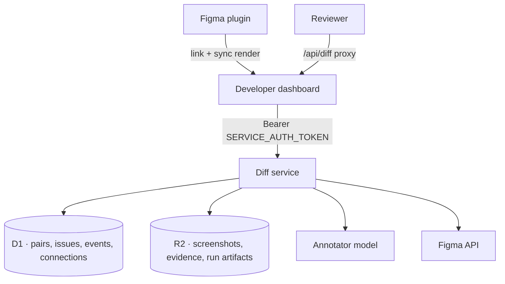

# Diff Service

The Diff Service is a Cloudflare Worker that powers visual review: comparing a Figma design against the Storybook story that implements it, and tracking what is wrong with the difference.

It owns the review domain — pairs, issues, severity, review locks — and the Figma connection used to import designs. The dashboard is its only direct client.

## Features

- **Pairs** - A Figma reference and a Storybook capture, registered by R2 key rather than copied
- **Issues** - Boxed, labelled findings against a pair, with a full lifecycle
- **AI annotation** - A structural pass over the pair that proposes findings as candidates
- **Diff tiers** - Basic, or Plus which adds an Opus check on busy screens; each run is metered and charged in [credits](/guide/credits)
- **Candidates and severity** - Nothing becomes a real issue until a person promotes it
- **Review queue** - Claim, release, done, and next-pair traversal with stale-lock recovery
- **Figma integration** - OAuth connection, file resolution, and design snapshot ingestion
- **Run artifacts** - Every annotation run writes auditable JSON to R2

## How it fits

**Browsers never talk to this service.** Every route except `GET /healthz` requires `Authorization: Bearer <SERVICE_AUTH_TOKEN>`, and only the dashboard server holds that token; the browser goes through the dashboard's `/api/diff` proxy. That makes the dashboard the authorization boundary — this service authenticates the *caller*, not the end user.

## Images are referenced, not copied

Both sides of a pair already live in the shared `scry-component-snapshot-bucket`: the Storybook capture was written there by build processing, and the Figma render by the plugin's sync. So a pair is registered with **R2 keys**, and images stream straight from the bucket binding.

Nothing is downloaded, nothing is duplicated, and re-registering a pair is idempotent — it reopens the review while preserving existing issues.

## Relationship to image-diff-flagger

This service is the production replacement for `image-diff-flagger`, the local Flask app, which remains the reference implementation for behaviour and API shapes. That lineage is why issue rows keep `box_a`/`box_b` as JSON strings, while the prediction export uses box objects — the export has to match the reference format exactly.

## In this section

- [API Reference](/services/diff-service/api-reference) - pairs, issues, review queue, Figma
- [Review Model](/services/diff-service/review-model) - candidates, severity, and what a re-run does
- [Deployment](/services/diff-service/deployment) - bindings, secrets, migrations
