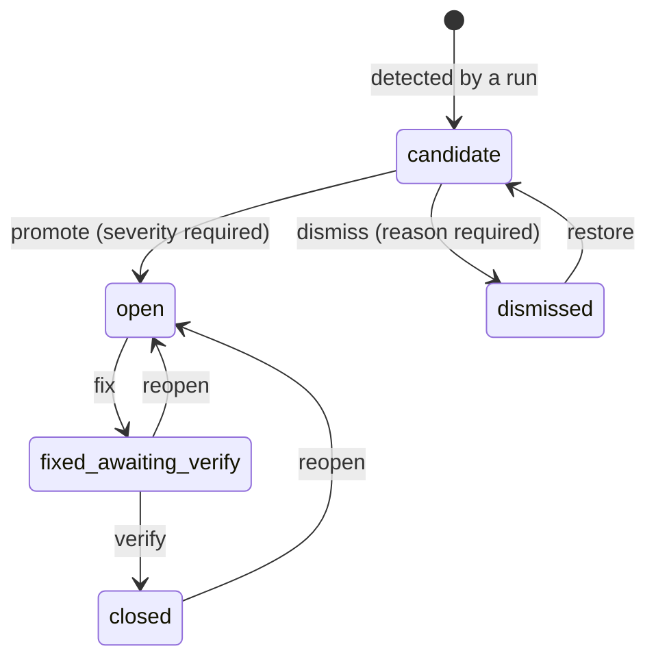

# Review Model

The point of this model is that **a machine may propose, but only a person disposes**. Annotation produces candidates; nothing counts as a real issue until someone promotes it and assigns a severity.

## Statuses



A **candidate** is numbered like any issue but has `severity` NULL, a `suggested_severity` from the annotator, and a `confidence` from 0 to 1.

Severity is `blocker`, `major`, `minor` or `nit`. A person chooses it at promotion and can change it afterwards, which records a `severity_set` event. Promotion is never bulk and never automatic.

## What counts as a real issue

Consumers that mean "real issue" filter:

```sql
status IN ('open', 'fixed_awaiting_verify', 'closed')
```

That is what `has_issues_count` on `GET /api/pairs/:id` reports, alongside a separate `candidate_count`. The same filter drives build-hop notifications, recheck, and the Design Sync issue chip in the dashboard. Grouping by status gives the "to triage" roll-up for free.

## What a re-run does

Re-running the annotator on a pair **never deletes anything**. Each new finding is matched against the pair's existing candidate and dismissed rows, by box IoU ≥ 0.6 on either side plus a shared label:

| Case | Result | Event |
| --- | --- | --- |
| New finding matches an existing row | Refreshed in place | `refreshed` |
| Match was already dismissed | **Stays dismissed** | `refreshed` |
| Existing candidate with no match | Becomes `dismissed(superseded)` | `superseded` |
| New finding with no match | Inserted as a candidate | `detected` |
| Promoted rows | Untouched | — |

A dismissed match staying dismissed is the important one: **that is the memory.** Dismissing a finding tells the system it is not worth looking at, and a later run must not resurrect it. Equally, promoted issues are never touched by the annotator — once a person has ruled, the machine does not overwrite the ruling.

## Hybrid evidence

Screenshots alone make for shallow analysis. Producers can register extra evidence on a pair as R2 keys, which the annotator reads:

| Key | Contains |
| --- | --- |
| `figma_structure_key` | Figma layer tree, stable node IDs, boxes relative to the exported frame |
| `dom_structure_key` | Live Storybook DOM, accessibility names, computed boxes and styles |
| `source_key` | Implementation source, when available |
| `icon_candidates_key` | Deterministic manifest of icon candidates |
| `icon_contact_sheet_key` | Enlarged paired crops |

Large trees and source never go into D1 — they are uploaded to the shared bucket and referenced.

**Both icon keys are required** to activate the second, enlarged-icon pass, which then merges into the main pass without a count cap.

Evidence is only preserved while its associated screenshot key is unchanged. A new Storybook capture clears stale DOM, source and icon evidence, and new evidence must be registered for that build before pass two is available again — stale evidence describing a previous build would be worse than none.

## Run artifacts

Every run writes auditable JSON under `diff-runs/<pair>/<run-id>/` in R2:

- `prediction.json` — the exported prediction
- `main-pass.json`, `icon-pass.json` — per-pass output
- `raw-pass-findings.json` — findings before reconciliation
- `hybrid-report.json` — how evidence was combined

These are readable through `GET /api/pairs/:pairId/runs/:runId/:artifact`, so a disputed finding can be traced back to what the model actually saw and said.

## Review locks

A reviewer claims a pair before working on it. Claims go stale after 180 seconds, after which anyone can take over — `POST /api/claim` with `force` takes it immediately. Queue traversal skips pairs that are done or live-locked by someone else, and wraps within the project.

## Inspect a finding pixel by pixel

Many findings describe drift too small to see at a glance: *glyph height 14 → 16 px*, *gap changes by 3 px*, *shifted horizontally by 2 px*. In the dashboard's diff editor, the **Evidence** strip under the Figma and Storybook panes shows the pixels behind one finding, so you can check it before you promote or dismiss it. The strip only reads the two screenshots you already have open. It writes nothing and costs nothing.

<figure>
  
  <figcaption>The Evidence strip with a candidate selected. Magenta pixels in the Diff tile are the ones that differ.</figcaption>
</figure>

### Choosing a finding

The strip shows the current finding. That's the one under your pointer in the Findings or Issues list, or the last one you picked: click an issue number, or click a box on either image. The selection sticks. Moving the pointer off a row leaves the last finding on screen, and it changes only when you pick another finding or click **×**. With nothing picked, the strip says *Select a finding to inspect it pixel by pixel*.

The header shows the finding's number and note, e.g. **Evidence · #143 · Vertical gap between 'Total' and 'Place order' changes by 3px**.

When you're drawing a new issue, the strip previews the box you're drawing before you add it. The header reads **Evidence · new issue · describe what you see**, so you can check the pixels first and then write the note.

### The three tiles

| Tile | Shows |
| --- | --- |
| **Figma** | The finding's Figma box cut from the Figma render, with 25% padding on each side (at least 8 px). The box is outlined. Caption: size in source pixels, e.g. `Figma · 132 × 46 px` |
| **Storybook** | The same for the Storybook box on the Storybook screenshot |
| **Diff** | Both crops lined up at their top-left corners and compared pixel by pixel. Differing pixels are magenta over a faded grey copy of the Figma crop. Anti-aliased edge pixels don't count. Caption: `Diff · 396 px differ (7%)`, or `0 px differ` when the crops match |

Pixels are drawn square (nearest-neighbour), so a 1 px edge stays a crisp 1 px step.

Some captions tell you the view is limited:

- **`same region · no Storybook box`** (or `no Figma box`): the finding has a box on one side only, like a missing divider or an extra line. The other tile shows the same region of its own image, with a dashed outline.
- **`· downsampled`**: the region is over 400 000 source pixels. It's shown at **Fit**, and the diff is computed on the smaller grid, so counts are approximate.
- **`· boxes differ in size · diff approximate`**: the two boxes differ by more than 25% in width or height. This happens mostly with issues a person drew separately on each pane. The count is still shown.

### Magnification

Pick **2×**, **4×**, **8×** or **Fit** in the strip header. The strip starts at the largest of 2×, 4× and 8× at which the padded crop fits the tile. If even 2× doesn't fit, it starts at **Fit**. Above that, the tile centres on the finding's box and clips the padding first. **Fit** scales the crop to the tile. From 4× up, a faint pixel grid is drawn over the tiles.

### Blink

A 1–3 px shift is easiest to see as movement. **Blink** swaps the Figma and Storybook crops in the Diff tile twice a second, with an **A** / **B** badge showing which one is on screen. Press **`B`** to turn Blink on or off. **`Esc`** stops it, and while Blink is on, `Esc` stops Blink before it closes the editor. The keys do nothing while you're typing in a field.

### Measured delta

When the pre-filter measured the finding on one axis (the issue's `evidence` field, see the [API reference](/services/diff-service/api-reference#issues)), the Figma and Storybook tiles label that measurement (e.g. `12 px` and `15 px`), and the header ends with **Δ +3 px · measured**. Issues people add, and findings recorded before this field existed, show no delta.

Viewers see the same strip. It has no triage buttons, so nothing changes for read-only members.
