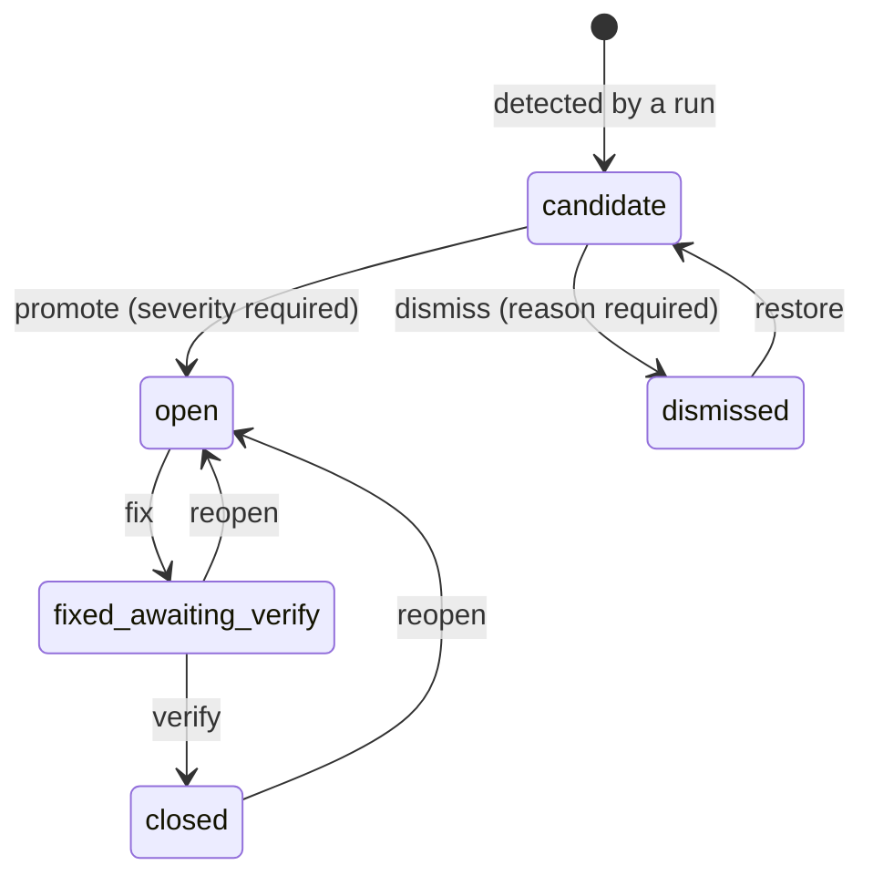

# Review Model

The point of this model is that **a machine may propose, but only a person disposes**. Annotation produces candidates; nothing counts as a real issue until someone promotes it and assigns a severity.

## Statuses



A **candidate** is numbered like any issue but has `severity` NULL, a `suggested_severity` from the annotator, and a `confidence` from 0 to 1.

Severity is `blocker`, `major`, `minor` or `nit`. A person chooses it at promotion and can change it afterwards, which records a `severity_set` event. Promotion is never bulk and never automatic.

## What counts as a real issue

Consumers that mean "real issue" filter:

```sql
status IN ('open', 'fixed_awaiting_verify', 'closed')
```

That is what `has_issues_count` on `GET /api/pairs/:id` reports, alongside a separate `candidate_count`. The same filter drives build-hop notifications, recheck, and the Design Sync issue chip in the dashboard. Grouping by status gives the "to triage" roll-up for free.

## What a re-run does

Re-running the annotator on a pair **never deletes anything**. Each new finding is matched against the pair's existing candidate and dismissed rows, by box IoU ≥ 0.6 on either side plus a shared label:

| Case | Result | Event |
| --- | --- | --- |
| New finding matches an existing row | Refreshed in place | `refreshed` |
| Match was already dismissed | **Stays dismissed** | `refreshed` |
| Existing candidate with no match | Becomes `dismissed(superseded)` | `superseded` |
| New finding with no match | Inserted as a candidate | `detected` |
| Promoted rows | Untouched | — |

A dismissed match staying dismissed is the important one: **that is the memory.** Dismissing a finding tells the system it is not worth looking at, and a later run must not resurrect it. Equally, promoted issues are never touched by the annotator — once a person has ruled, the machine does not overwrite the ruling.

## Hybrid evidence

Screenshots alone make for shallow analysis. Producers can register extra evidence on a pair as R2 keys, which the annotator reads:

| Key | Contains |
| --- | --- |
| `figma_structure_key` | Figma layer tree, stable node IDs, boxes relative to the exported frame |
| `dom_structure_key` | Live Storybook DOM, accessibility names, computed boxes and styles |
| `source_key` | Implementation source, when available |
| `icon_candidates_key` | Deterministic manifest of icon candidates |
| `icon_contact_sheet_key` | Enlarged paired crops |

Large trees and source never go into D1 — they are uploaded to the shared bucket and referenced.

**Both icon keys are required** to activate the second, enlarged-icon pass, which then merges into the main pass without a count cap.

Evidence is only preserved while its associated screenshot key is unchanged. A new Storybook capture clears stale DOM, source and icon evidence, and new evidence must be registered for that build before pass two is available again — stale evidence describing a previous build would be worse than none.

## Run artifacts

Every run writes auditable JSON under `diff-runs/<pair>/<run-id>/` in R2:

- `prediction.json` — the exported prediction
- `main-pass.json`, `icon-pass.json` — per-pass output
- `raw-pass-findings.json` — findings before reconciliation
- `hybrid-report.json` — how evidence was combined

These are readable through `GET /api/pairs/:pairId/runs/:runId/:artifact`, so a disputed finding can be traced back to what the model actually saw and said.

## Review locks

A reviewer claims a pair before working on it. Claims go stale after 180 seconds, after which anyone can take over — `POST /api/claim` with `force` takes it immediately. Queue traversal skips pairs that are done or live-locked by someone else, and wraps within the project.
