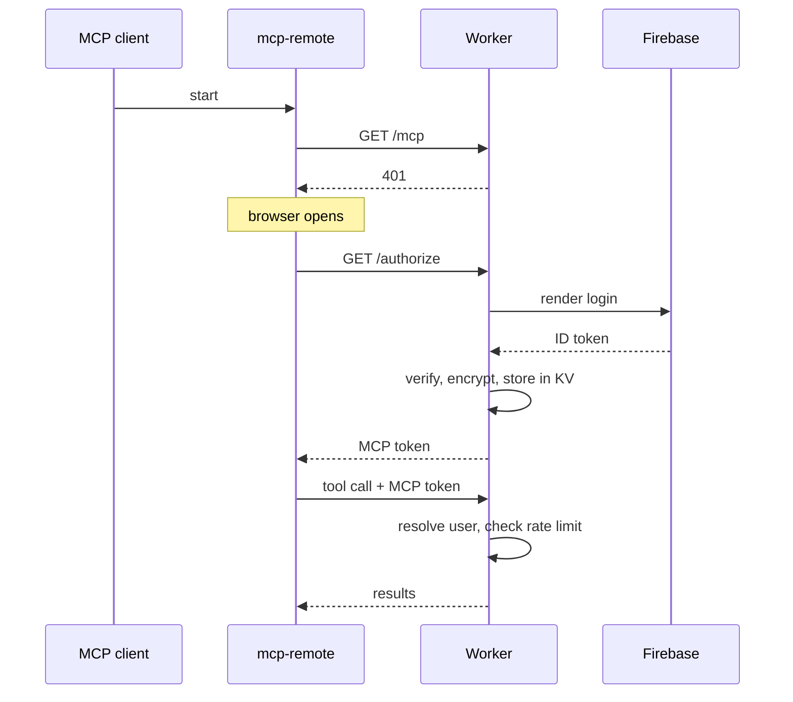

# Authentication

The MCP server sits between two OAuth relationships. To the MCP client it **is** the authorization server. To Firebase it is a client. The two never meet: the client's token and the user's Firebase token are different credentials with different lifetimes.

## Why it is built this way

An MCP client is software running on the user's machine, often an assistant that can be steered by whatever it reads. Handing it a Firebase session token would give it an identity far beyond MCP, reusable against every service that trusts Firebase. So the Worker verifies the user upstream, keeps that token, and mints a separate MCP-scoped token for the client.

## The flow

Clients that speak Streamable HTTP natively skip `mcp-remote` and perform the same exchange directly.

## Token isolation

- The Firebase ID token is **verified and then encrypted into KV**. It is never returned to the client.
- The client receives an MCP token that is only meaningful to this Worker.
- Every tool call resolves the user from that token; a tool cannot name a different user.

The search API applies its own project access check on top, using the identity the Worker passes it. Authentication at the MCP boundary is not treated as authorization over project data.

## Session protection

| Control | Detail |
| --- | --- |
| Cookies | `__Host-` prefixed, `HttpOnly`, `Secure`, `SameSite=Lax` |
| Rate limiting | 60 requests per minute per user, sliding window in the Durable Object |
| Timeouts | 30s `AbortController` on every upstream call |
| Input validation | Zod schemas: 500-char queries, 10MB images, 128-char project ids |
| Screenshots | Presigned URLs, 1 hour. R2 credentials stay in the search service |

## What a user sees

The first tool call opens a browser window for Firebase sign-in — Google or email, whichever the project has enabled. Approving it completes the exchange and the client stores the MCP token. `whoami` confirms which account is connected, which is the fastest way to explain "why can't it see my project": usually the client authenticated as a different account from the one holding project membership.

Revoking access is a Firebase-side operation on the user's session; the MCP token stops resolving once the stored upstream credential is no longer valid.
