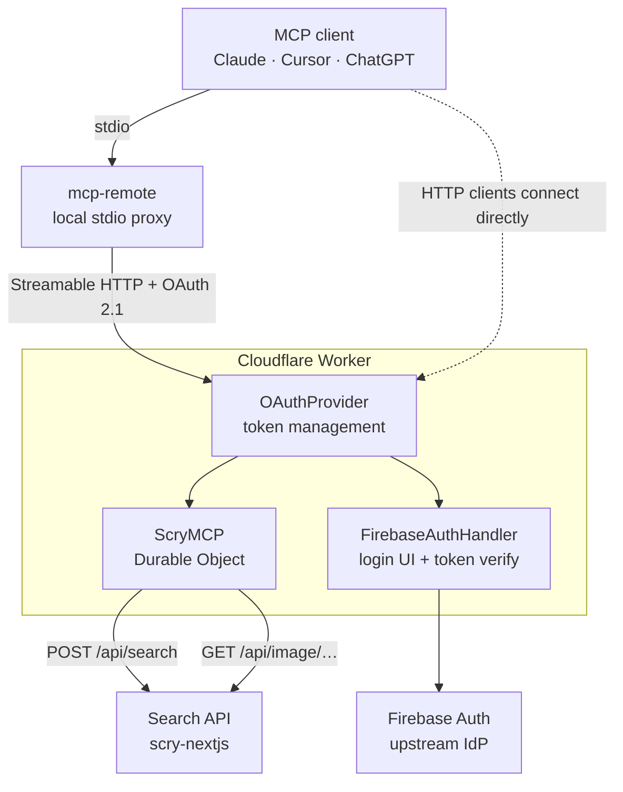

# MCP Server

The MCP Server is a Cloudflare Worker that exposes Scry's component search over the [Model Context Protocol](https://modelcontextprotocol.io/), so an AI assistant can search your indexed Storybook builds directly.

It is spec-compliant and remote: clients connect over Streamable HTTP with OAuth 2.1, and any MCP client can reach it through [`mcp-remote`](https://www.npmjs.com/package/mcp-remote).

For connecting a client, see the [MCP guide](/guide/mcp).

## Features

- **Multi-modal search** - Text, image, or hybrid queries over the component index
- **Its own OAuth server** - Issues MCP-scoped tokens to clients; Firebase tokens never leave the Worker
- **Project scoping** - Every query is filtered to what the authenticated account may read
- **Screenshot delivery** - Presigned, time-limited URLs rather than public links
- **Rate limiting** - 60 requests per minute per user, tracked in a Durable Object
- **Freshness metadata** - Results say which build they came from and whether it is current

## Architecture



The Worker is **both** an OAuth server to the MCP client and an OAuth client to Firebase. Clients that speak HTTP natively connect straight to it; stdio-only clients go through `mcp-remote`.

Tool calls run in a Durable Object, which is also where per-user rate limiting lives. The Worker holds no component data of its own — it calls the search API, which owns the index and the access checks.

## Project structure

```
src/
├── index.ts            # Worker entry: OAuthProvider wiring
├── mcp.ts              # ScryMCP Durable Object, tool registration
├── firebase-handler.ts # Login UI, Firebase token verification
└── utils/
```

## Endpoints

| Path | Purpose |
| --- | --- |
| `/mcp` | The MCP endpoint. `401` without a valid token |
| `/.well-known/oauth-authorization-server` | OAuth metadata, public |
| `/authorize`, `/token` | OAuth 2.1 authorization and token exchange |

Production is `https://mcp.scrymore.com`, with `https://mcp-stage.scrymore.com` running the same code against stage data. The original `*.workers.dev` URL still resolves.

## In this section

- [Tools](/services/mcp-server/tools) - the five tools, their parameters, and the result shape
- [Authentication](/services/mcp-server/authentication) - the two-sided OAuth flow and token isolation
- [Deployment](/services/mcp-server/deployment) - configuration, bindings, and release
