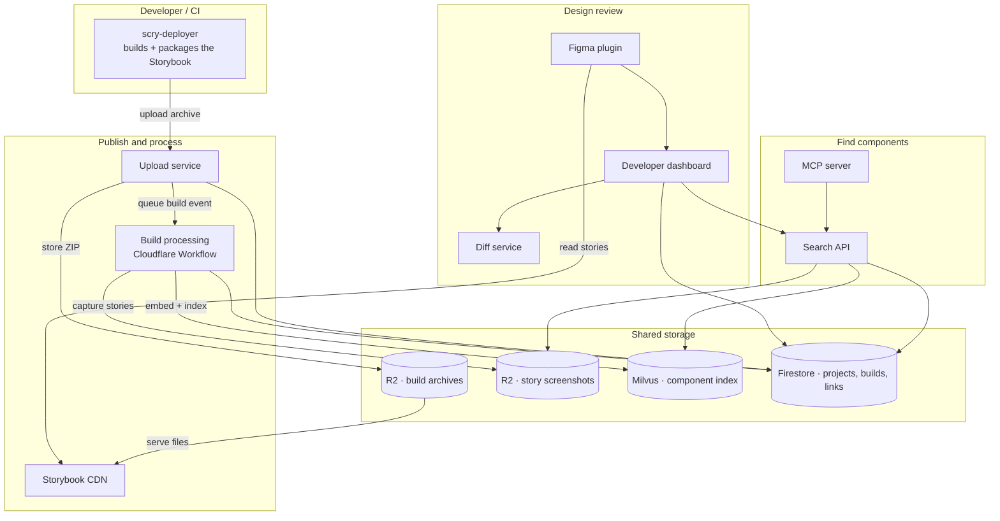
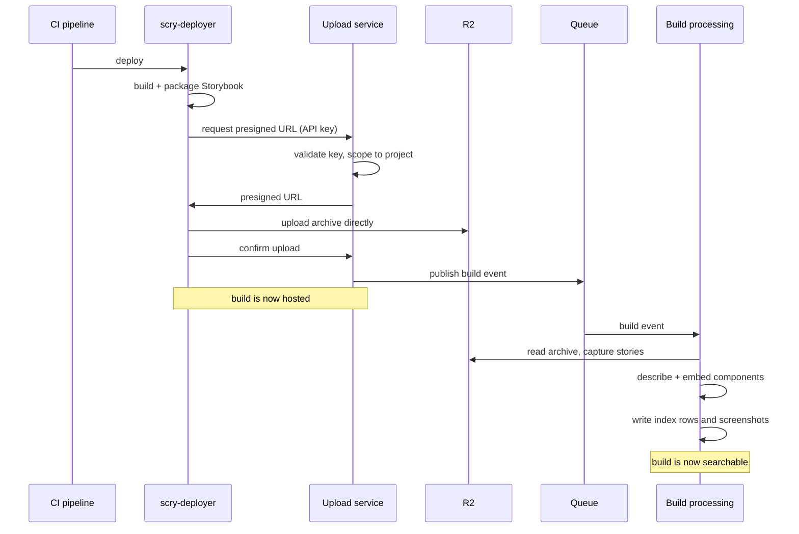
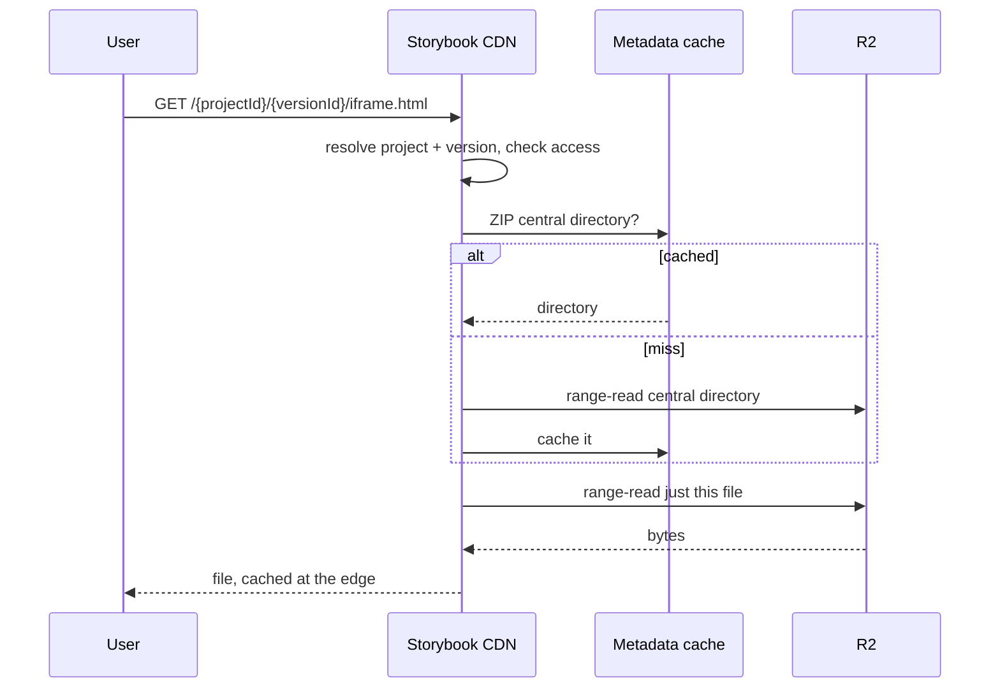

# Architecture Overview

Scry connects three workflows that share project identity and artifacts:

1. **Publish and process** a Storybook build — host it, capture every story, and index it.
2. **Find components** — search that index by text or image, from the dashboard or an AI assistant.
3. **Link and review designs** — connect Figma layers to stories and compare them.

Hosting, indexing and review complete independently. A build can be served before it finishes indexing, so each workflow reports its own state rather than a single global "ready".

## System architecture

## Services

| Service | Production host | Role |
| --- | --- | --- |
| CLI (`@scrymore/scry-deployer`) | npm | Builds, packages and uploads a Storybook from CI |
| Upload service | `upload.scrymore.com` | Validates API keys, stores archives, records builds, queues processing |
| Build processing | `build.scrymore.com` | Extracts the archive, captures stories, describes and embeds them, writes the index |
| Storybook CDN | `view.scrymore.com` | Serves builds straight out of their ZIP, with access control for private projects |
| Search API | `search.scrymore.com` | Text and image search over the index, with project scoping and access checks |
| MCP server | `mcp.scrymore.com` | Exposes search to AI assistants over the Model Context Protocol |
| Developer dashboard | `dashboard.scrymore.com` | Projects, members, API keys, build history, design links and review |
| Diff service | `diff.scrymore.com` | Design-versus-implementation pairs, issues, and the Figma connection |
| Figma plugin | Figma Community | Links layers to stories, suggests links, syncs renders |

Each service also answers on a `-stage` host (`upload-stage.scrymore.com`, and so on) running the same code against isolated data.

### CLI

Runs in your pipeline: builds the Storybook, packages the static output, requests a presigned URL, and uploads directly to storage. It can also capture per-story screenshots during the build, which is what later makes visual search and design diffing possible.

[Learn more about the CLI →](/cli/)

### Upload service

A Cloudflare Worker on Hono. Validates the project API key, issues presigned URLs so file data never proxies through the service, writes the build record to Firestore, and publishes a build event onto a queue.

Storing the archive and queueing processing are **separate effects**: an upload can succeed while indexing has not yet started, which is why the build record carries its own status.

[Learn more about the Upload Service →](/services/upload-service/)

### Build processing

A Cloudflare Workflow, triggered by the queue. It extracts the archive, captures each story, generates a description and embeddings for every component, and writes rows into the search index alongside screenshots in object storage. Because these are multiple external writes, progress is tracked per step rather than as one transaction.

### Storybook CDN

Serves files at `view.scrymore.com/{projectId}/{versionId}/{path}` — for example the [demo Storybook](https://view.scrymore.com/U9m2H2yeC9wFiR4hlMta/demo-1786260947/). Rather than unpacking archives, it reads the ZIP central directory, caches that metadata, and extracts only the bytes for the file requested, using range reads. Private projects are gated here, including the short-lived signed tokens the Figma plugin uses to preview a private story.

[Learn more about the CDN Service →](/services/cdn-service/)

### Search API and MCP

The search API embeds a query — text or image — and searches the component index, then filters by what the caller may see. Results are pinned to a project's current build so older deploys don't compete, and each row reports its freshness.

The MCP server puts the same search in front of an AI assistant, brokering the client's identity so results respect that user's project access.

### Developer dashboard

More than a frontend: it owns project and member records, API keys and personal access tokens, the Figma link APIs the plugin calls, and review orchestration. It authenticates users through Firebase — Google, GitHub or email — and is the authorization boundary for everything the plugin does.

[Learn more about the Dashboard →](/services/dashboard/)

### Diff service and Figma plugin

The plugin links a Figma layer to a story and, for signed-in users, uploads the Figma render so the two can be compared. The diff service holds the pairs, the issues raised against them, and the Figma OAuth connection used to import designs.

Annotation proposes findings, but nothing becomes a real issue until a person promotes it and sets a severity — see the [Diff Service](/services/diff-service/) for that model.

[Learn more about the Figma plugin →](/guide/figma-plugin)

## Data flow

### Publish

### View

## Storage

| Store | Holds |
| --- | --- |
| R2 — build archives | The uploaded Storybook ZIP per project and version |
| R2 — screenshots | One image per story, keyed `{projectId}/{buildId}/{storyId}.png`, plus Figma renders per link |
| Firestore | Projects, membership and visibility, builds, API keys, and Figma links |
| Milvus | One row per component: embeddings, description, story identity, and the build it came from |
| D1 | Diff pairs, issues, review state, and Figma connections |
| KV | Cached ZIP central directories, so repeat reads skip a round trip |

Object keys are derived deterministically from project, build and story, so a screenshot can be located without a lookup — which also means producers and consumers must agree on exactly how a story id is sanitized.

## Security

**Project API keys** authenticate CI. Only hashes are stored, and a key is scoped to one project.

**User credentials** are Firebase sessions in the dashboard, and personal access tokens for the CLI and Figma plugin.

**Access control** is by project visibility and membership. A private project is readable only by its members, and that decision is enforced by each service that serves project data — the CDN, the search API and the dashboard — not just at the edge.

**Service-to-service calls** carry a shared key proving the caller is a trusted service, plus a short-lived signed assertion naming the user being acted for. The key alone never implies a user: identity has to be proven separately, so one service cannot read another tenant's data by claiming an id.

**Presigned URLs** move file data directly between the client and storage, so large artifacts never pass through a worker.

## Self-hosting

The Workers services deploy to Cloudflare, and the dashboard to Vercel or any Node host. The search index and model calls are the external dependencies to plan for.

[Learn more about self-hosting →](/self-hosting/)

## Next steps

- [Upload Service](/services/upload-service/) — uploads and build records
- [CDN Service](/services/cdn-service/) — serving builds
- [Dashboard](/services/dashboard/) — projects, keys and review
- [Figma plugin](/guide/figma-plugin) — linking designs to stories
- [Diff Service](/services/diff-service/) — pairs, issues and review
- [Self-Hosting](/self-hosting/) — run your own
