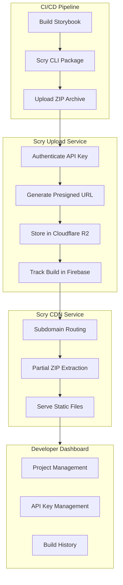
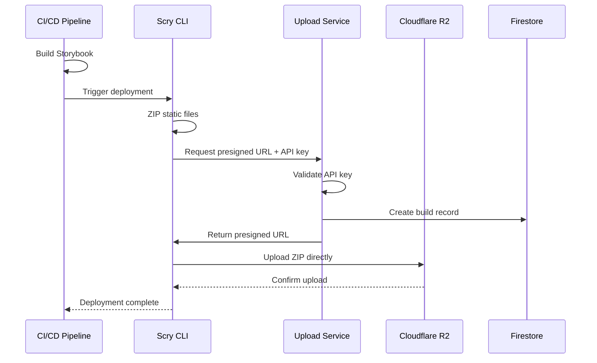
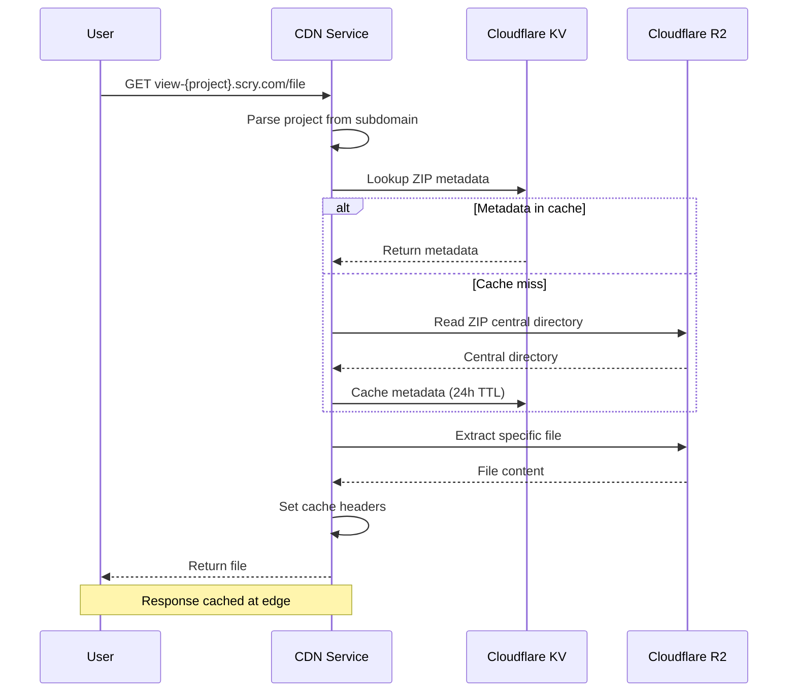
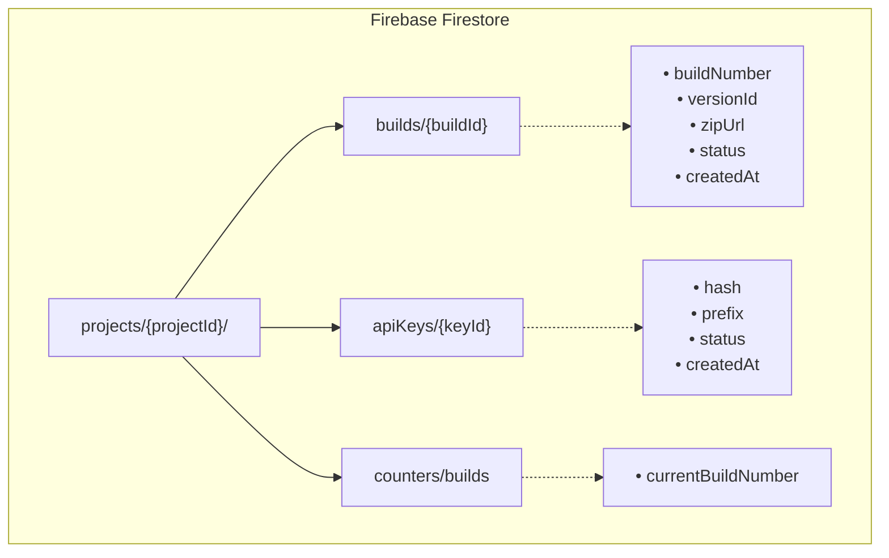

# Architecture Overview

Scry is composed of three main services that work together to provide Storybook deployment and hosting.

## System Architecture



## Services

### 1. CLI (`@scry/storybook-deployer`)

The command-line tool that developers use in their CI/CD pipelines.

**Responsibilities:**
- Initialize project configuration
- Build and zip Storybook static files
- Authenticate with the upload service
- Upload to cloud storage

**Technology:**
- Node.js
- TypeScript
- Published to npm

[Learn more about the CLI →](/cli/)

### 2. Upload Service

A Cloudflare Worker that handles file uploads and build tracking.

**Responsibilities:**
- Validate API keys
- Generate presigned URLs for direct upload
- Track builds in Firebase Firestore
- Manage build numbers and versions

**Technology:**
- Cloudflare Workers
- Hono framework
- Firebase Firestore
- Cloudflare R2

[Learn more about the Upload Service →](/services/upload-service/)

### 3. CDN Service

A Cloudflare Worker that serves Storybook builds from R2 storage.

**Responsibilities:**
- Route requests by subdomain
- Extract files from ZIP archives on-demand
- Cache metadata in Cloudflare KV
- Serve static files with proper MIME types

**Technology:**
- Cloudflare Workers
- Hono framework
- Cloudflare R2 & KV
- Partial ZIP extraction

[Learn more about the CDN Service →](/services/cdn-service/)

### 4. Developer Dashboard

A web application for managing projects and API keys.

**Responsibilities:**
- User authentication (GitHub OAuth)
- Project creation and management
- API key generation and revocation
- Build history viewing

**Technology:**
- Next.js
- TypeScript
- Firebase (Auth, Firestore)
- Tailwind CSS

[Learn more about the Dashboard →](/services/dashboard/)

## Data Flow

### Upload Flow



### View Flow



## Storage

### Cloudflare R2

Object storage for Storybook builds:

```
static-sites/
├── {project-id}/
│   ├── latest.zip
│   ├── v1.0.0.zip
│   ├── pr-123.zip
│   └── ...
```

### Firebase Firestore

Database for build metadata and API keys:



Or as a hierarchical structure:

```
projects/{projectId}/
├── builds/{buildId}
│   ├── buildNumber
│   ├── versionId
│   ├── zipUrl
│   ├── status
│   └── createdAt
├── apiKeys/{keyId}
│   ├── hash
│   ├── prefix
│   ├── status
│   └── createdAt
└── counters/builds
    └── currentBuildNumber
```

### Cloudflare KV

Cache for ZIP central directory metadata:

```
cd:{project-id}.zip → {central directory metadata}
```

TTL: 24 hours

## Security

### API Key Authentication

- Keys follow format: `scry_proj_{projectId}_{randomString}`
- Only SHA-256 hashes stored in Firestore
- Keys are project-scoped
- Optional expiration support

### Presigned URLs

- Short-lived URLs for direct upload
- No need to proxy file data through service
- Reduces bandwidth and latency

### Build Isolation

- Each project has isolated storage namespace
- Subdomain routing prevents cross-project access
- API keys only work for their assigned project

## Performance

### CDN Edge Caching

- Static files cached at Cloudflare edge
- Long cache TTL (1 year for versioned files)
- Immutable content headers

### Partial ZIP Extraction

- Only extract requested files
- ~50x less data transfer vs full download
- Central directory cached in KV

### Metrics

| Metric | Value |
|--------|-------|
| Cache miss (first request) | ~62ms |
| Cache hit | ~31ms |
| Edge locations | 300+ |

## Self-Hosting

All services can be self-hosted:

1. **Upload Service** - Deploy to Cloudflare Workers
2. **CDN Service** - Deploy to Cloudflare Workers
3. **Dashboard** - Deploy to Vercel or any Node.js host

[Learn more about self-hosting →](/self-hosting/)

## Next Steps

- [Upload Service](/services/upload-service/) - Learn about file uploads
- [CDN Service](/services/cdn-service/) - Learn about file serving
- [Dashboard](/services/dashboard/) - Learn about project management
- [Self-Hosting](/self-hosting/) - Deploy your own instance
